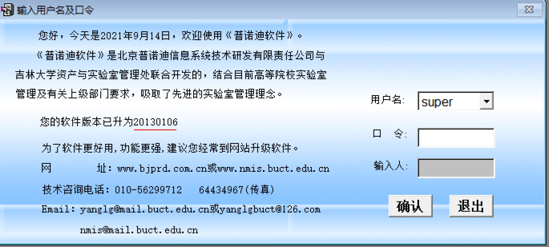

高校实验项目及人员管理系统 辅助系统
----

== 开发环境
系统环境依赖于docker，具体步骤步骤如下

```bash
$ cd tute
$ docker-compose up -d
$ docker exec -it tute-lab /bin/bash
root$ cd /root/tute
root$ python main.py
```

数据格式详情参考`tute/task.xls`文件，具体使用方法详见tute文件夹。

本系统为以下系统的辅助系统，原则上可以脱离《高校实验项目及人员管理系统》而独立使用，但为保险起见，仍然建立将生成的数据导入系统后执行查错处理.

系统适用的《高校实验项目及人员管理系统》版本截图如下：



